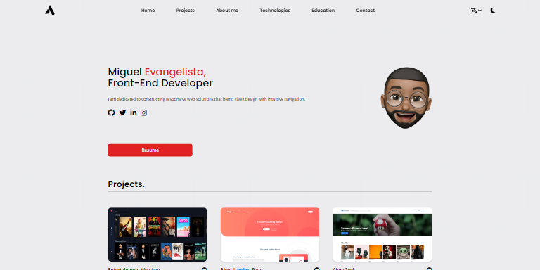

# Portfolio - Miguel Evangelista

This is a solution to the [Portfolio on Alura Latam](https://www.aluracursos.com/).

### Preview

## The challenge

The challenge was to create a portfolio where we can show our projects to possible recruiters.

### Requirements

It should contain a navigation menu.
It should contain an image that will be used as a banner.
It should contain a section about me.

It should contain links to your social networks.
It must have a training and courses section.

It must have a contact form with the following fields

It should have a Footer with the information of the person who developed the portfolio.
It is extremely important that the portfolio is responsive, which means that it must adapt to different screen sizes, which can be desktop, tablet or mobile.

Additional features:

- The page must contain a button that allows you to view, in a new tab, a PDF version of your resume.

### Links

[Portfolio Live URL](https://www.migueldev.com/)  

### Built with

- HTML5
- CSS 3
- Tailwind CSS
- Flexbox
- Grid
- JavaScript
- React JS
- Mobile-first workflow

## Autor

- GiHub - [Miguelaeb](https://github.com/Miguelaeb)
- Linkedin - [Miguel Evangelista](https://www.linkedin.com/in/miguel-evangelista-8458b9150/)
- Instagram - [@Miguel_aeb](https://instagram.com/miguel_aeb?igshid=YmMyMTA2M2Y=)
- Frontend Mentor - [@Miguelaeb](https://www.frontendmentor.io/profile/Miguelaeb)
